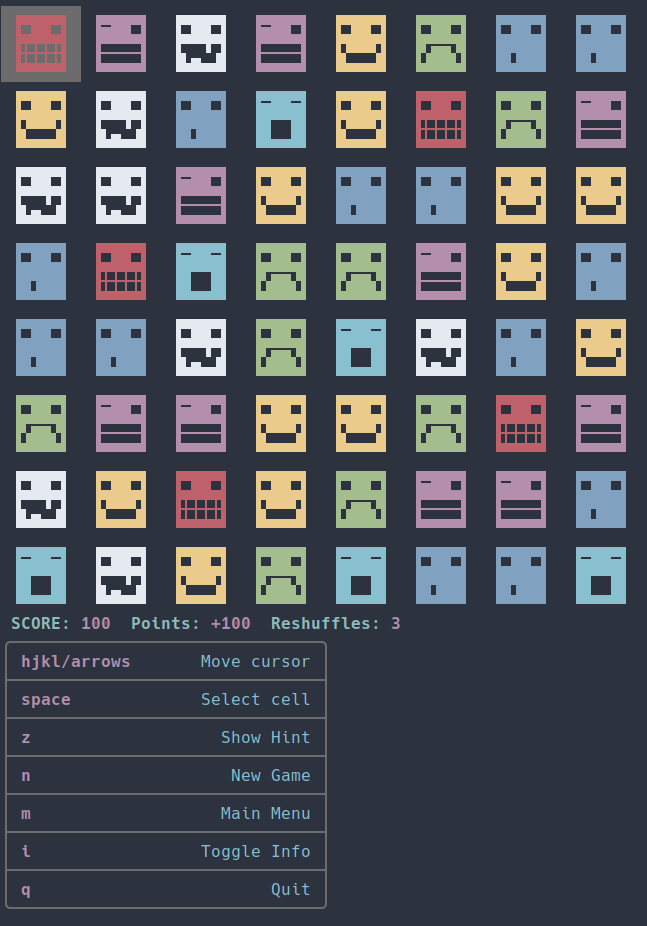
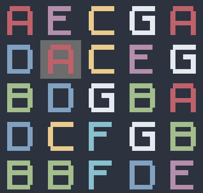
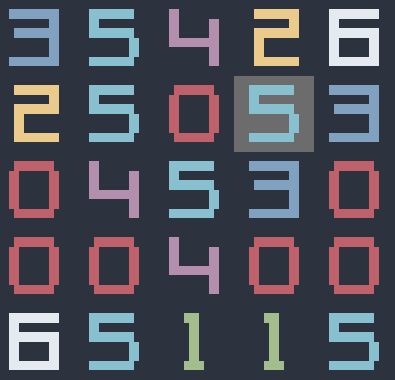
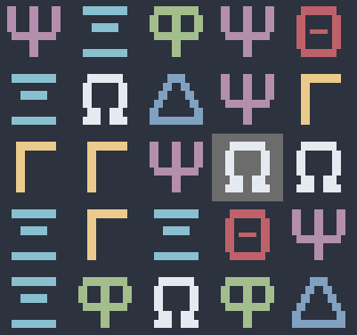
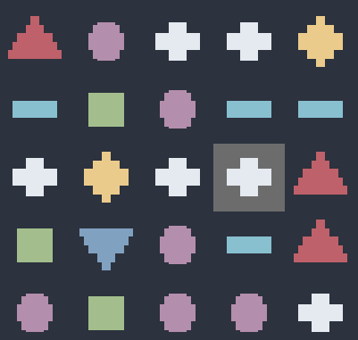
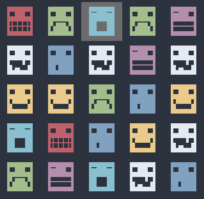
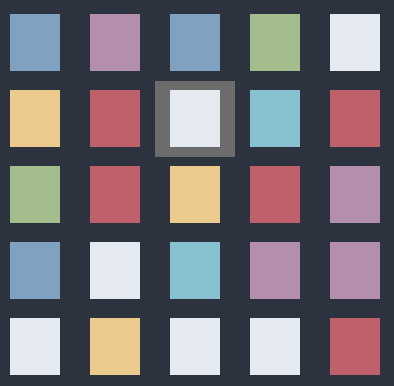
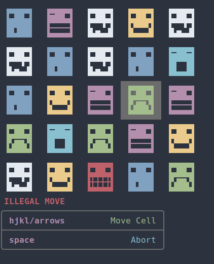
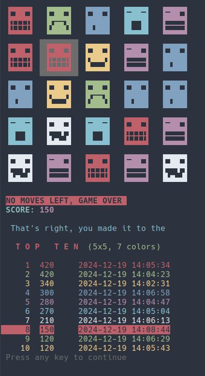
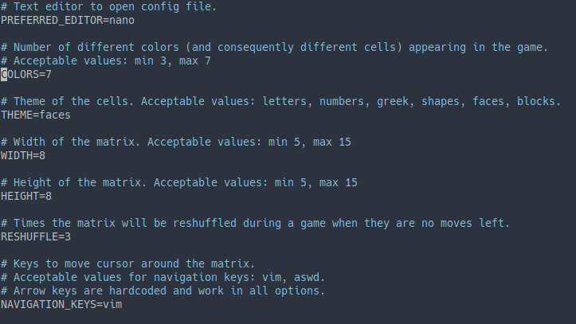

# Matching

**Matching** is a terminal [match-three game](https://en.wikipedia.org/wiki/Tile-matching_video_game), written in Bash.

The aim is to gain points by swapping two adjacent grid cells to create rows or columns of three or more matching cells, which will disappear and allow the above cells to fall and occupy the vacant space.

{width=400}

This game was inspired by [Bejeweled](<https://en.wikipedia.org/wiki/Bejeweled_(video_game)>).

When there are no moves left, the **grid will be refreshed, and the game will continue until all (configured) reshuffles are used**. When there are no moves left, and no reshuffles left, **the game will end**.

If the score is among the 10 best scores achieved, it makes it in the **Top Ten Highscores**.

As far as the appearence of the game, by configuring the game accordinly, the user can select the game theme according to their liking.

The user has select theme between `letters`, `numbers`, `greek`, `shapes`, `faces` and `blocks`.

The colors selected are the configured terminal theme colors.

{width=250}
{width=250}
{width=250}
{width=250}
{width=250}
{width=250}

---

## Install

- Clone to repository, and move to the `matching` directory:

```
git clone https://github.com/fladdracula/matching.git&&cd matching/
```

- Make `install.sh` executable, then run it

```
chmod +x install.sh&&./install.sh
```

You are good to go. The script can be run from the `matching/` directory:

```
./matching.sh
```

---

---

## Playing

Opening the game, the user through the main menu, can:

- Start a new game

- Configure the parameters of the game according to taste

- Check out highscores

- Just quit the game

---

{width=300}

While playing the user can:

- Move the cursor around the grid (`h`, `j`, `k`, `l` or other assigned keys, `arrow keys`)

- Select a cell to move (`space`)

- Show a hint, and move the cursor to a possible solution (`z`)

- Play a new game (`n`)

- Return to the main menu (`m`)

- Toggle info (`i`)

- Quit the game altogether (`q`)

While selecting a cell to move (`z` option), the user can either:

- Move the selected cell one position to the left/right/up or down (`arrow keys` or assigned keys `hjkl` or `aswd`)

- Abort moving cell, continue with the game (`space`).

{width=300}

When there are no moves left, the **grid will be refreshed, and the game will continue until all (confingured) reshuffles are used**. When there are no moves left, and no reshuffles left, **the game will end**.

{width=300}

---

## Configuring

As mentioned above, the games parameters can be configured within the game from the `main menu`, or by editing the `$HOME/.config/mactching/matching.config` file.

| n   | Variable           | Explanation                                                                              | Acceptable Values                                          | Default Value    |
| --- | ------------------ | ---------------------------------------------------------------------------------------- | ---------------------------------------------------------- | ---------------- |
| 1   | `PREFERRED_EDITOR` | Editor to be used to open the config file                                                | Any gui or tui text editor                                 | `${EDITOR-nano}` |
| 2   | `COLORS`           | Number of different colors (and consequently different cells) appearing in the game.     | min `3`, max `7`                                           | `7`              |
| 3   | `THEMES`           | Theme of the cells.                                                                      | `letters`, `numbers`, `greek`, `shapes`, `faces`, `blocks` | `faces`          |
| 4   | `WIDTH`            | Width of the matrix.                                                                     | min 5, max 15                                              | `8`              |
| 5   | `HEIGHT`           | Height of the matrix.                                                                    | min `5`, max `15`                                          | `8`              |
| 6   | `RESHUFFLE`        | Times the matrix will be reshuffled during a game when they are no moves left.           | min `0`                                                    | `3`              |
| 7   | `NAVIGATION_KEYS`  | Keys to move cursor around the matrix. Arrow keys are hardcoded and work in all options. | `vim`, `aswd`                                              | `vim`            |

{width=350}

- If the configuration file is not properly loaded, the game will begin with hardcoded default values.

---

**Enjoy!**
